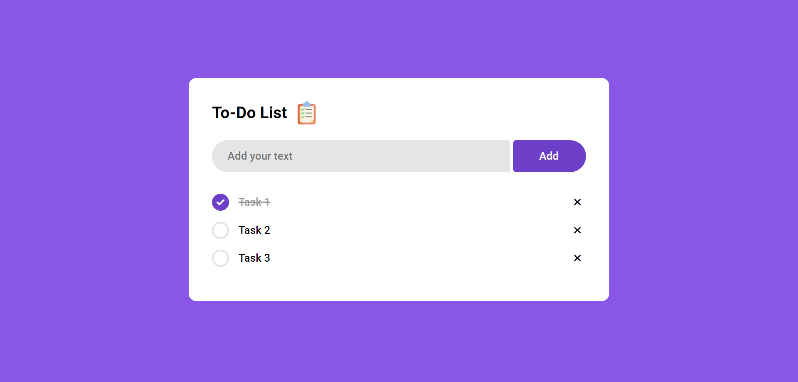

# To-Do List App
Hi, this repository contains a simple to-do list web application created using HTML, CSS, and JavaScript. The To-do List App allows users to manage their tasks by adding, editing, and deleting items on their to-do list. It provides a user-friendly interface with functionalities to organize tasks efficiently.

Built with:

  

## Output:

